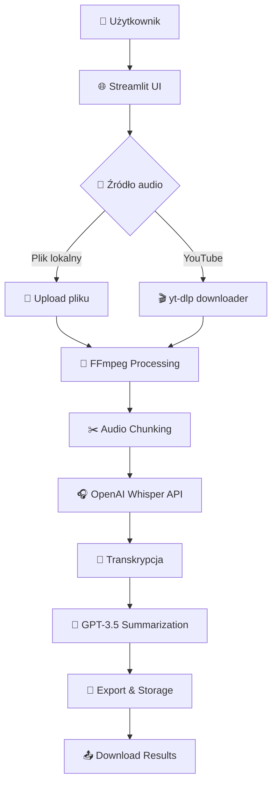

# 🏗️ Architektura Audio2Tekst

## 📊 Diagram systemu

## 🔄 Przepływ danych

1. **Input** → User uploads file lub podaje YouTube URL
2. **Processing** → FFmpeg konwertuje do MP3, dzieli na chunki
3. **Transcription** → Whisper API transkrybuje każdy chunk
4. **AI Summary** → GPT-3.5 generuje temat i podsumowanie
5. **Output** → Użytkownik pobiera transkrypcję i podsumowanie

## 🛡️ Bezpieczeństwo

- API keys przez environment variables
- Walidacja formatów plików
- Automatyczne czyszczenie plików tymczasowych
- Rate limiting dla API calls

## ⚡ Optymalizacje

- Chunking dla dużych plików (>25MB)
- Streamlit caching dla lepszej wydajności
- Asynchroniczne przetwarzanie UI
- Cross-platform compatibility layer
