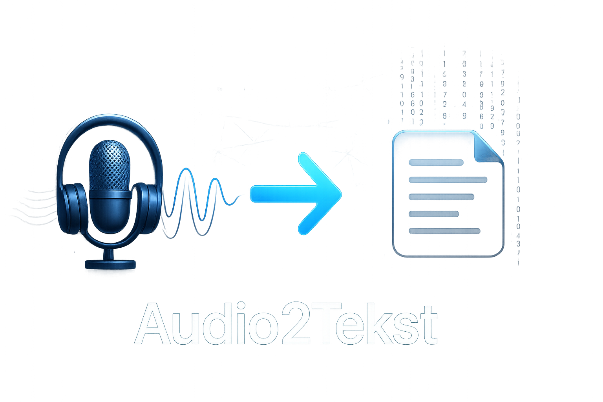

# 🎧 Audio2Tekst 📝

<div align="center">
  
</div>

<div align="center">

[](https://python.org)
[](https://streamlit.io)
[](https://opensource.org/licenses/MIT)
[](https://github.com/AlanSteinbarth/Audio2Tekst)
[](https://github.com/AlanSteinbarth/Audio2Tekst/actions)
[](https://github.com/AlanSteinbarth/Audio2Tekst/actions)

[]()
[]()
[]()
[]()
[]()
[]()

<!-- **🌐 [WYPRÓBUJ DEMO NA ŻYWO](https://audio2tekst-demo.streamlit.app)** | --> **📖 [Przypadki użycia](USE_CASES.md)** | **🏗️ [Architektura](ARCHITECTURE.md)**

</div>

> **Profesjonalne narzędzie do transkrypcji audio i video na tekst z automatycznym podsumowaniem**  
> **🌍 Uniwersalna kompatybilność z Windows, macOS i Linux**

Aplikacja webowa stworzona przy użyciu Streamlit, która umożliwia transkrypcję plików audio/video oraz filmów z YouTube na tekst, a następnie generuje ich inteligentne podsumowania przy użyciu OpenAI API.

## 🚀 Funkcjonalności

- ✅ **Transkrypcja plików lokalnych** - obsługa formatów: MP3, WAV, M4A, MP4, MOV, AVI, WEBM
- ✅ **Transkrypcja z YouTube** - bezpośrednia transkrypcja audio z filmów YouTube
- ✅ **Automatyczne podsumowanie** - generowanie tematu i podsumowania przy użyciu GPT-3.5
- ✅ **Inteligentne dzielenie długich tekstów** - automatyczny podział tekstów >8000 znaków na fragmenty
- ✅ **Hierarchiczne podsumowywanie** - fragmenty→podsumowania cząstkowe→finalne podsumowanie całości
- ✅ **Obsługa ograniczeń OpenAI** - rozwiązanie problemów z długością promptu i limitem tokenów
- ✅ **Czyszczenie transkrypcji** - usuwanie artefaktów mowy (um, uh, em, itp.)
- ✅ **Podział długich plików** - automatyczny podział na 5-minutowe segmenty
- ✅ **Eksport wyników** - pobieranie transkrypcji i podsumowań jako pliki tekstowe
- ✅ **Inteligentna konwersja audio** - automatyczne przekształcanie plików video (MP4, WEBM, MOV, AVI) do MP3 podczas pobierania
- ✅ **Ulepszony UI** - przycisk pobierania audio umieszczony bezpośrednio pod odtwarzaczem dla lepszego UX
- ✅ **Cache'owanie** - optymalizacja wydajności dzięki Streamlit cache
- ✅ **Wielojęzyczność** - domyślnie polski, z możliwością rozszerzenia
- 🌍 **Cross-Platform** - pełna kompatybilność z Windows, macOS i Linux
- 🔍 **Automatyczne wykrywanie systemu** - inteligentne dostosowanie do platformy
- ⚡ **Sprawdzanie zależności** - automatyczna weryfikacja FFmpeg/FFprobe

## 🛠️ Stack technologiczny

### Backend & AI
- **Python 3.8+** - główny język programowania  
- **OpenAI Whisper API** - state-of-the-art speech recognition
- **OpenAI GPT-3.5** - inteligentne podsumowania AI
- **Streamlit** - nowoczesny framework webowy

### Przetwarzanie mediów
- **FFmpeg** - profesjonalna konwersja audio/video
- **yt-dlp** - niezawodne pobieranie z YouTube  
- **Audio processing** - chunking, format conversion, normalization

### DevOps & Production
- **Docker** - konteneryzacja aplikacji
- **GitHub Actions** - automatyczne CI/CD
- **Cross-platform** - Windows/macOS/Linux support
- **Security scanning** - Bandit, Safety, Semgrep

## 🧩 Rozwiązane wyzwania techniczne

### 🔧 Obsługa dużych plików audio (>25MB)
**Problem**: OpenAI Whisper API ma limit rozmiaru pojedynczego pliku  
**Rozwiązanie**: Implementacja intelligent chunking
- Automatyczny podział na 5-minutowe segmenty z overlappingiem
- Zachowanie kontekstu między fragmentami  
- Optymalne wykorzystanie API rate limits

### 🌍 Cross-platform compatibility
**Problem**: Różne ścieżki FFmpeg, kodowanie plików na Windows/macOS/Linux  
**Rozwiązanie**: Abstrakcja warstwy systemowej
- Automatyczne wykrywanie OS i ścieżek do narzędzi
- Uniwersalne kodowanie UTF-8/UTF-8-sig
- Graceful fallback gdy brakuje zależności

### 🤖 OpenAI API token limits  
**Problem**: Długie transkrypcje >8000 znaków przekraczają context window  
**Rozwiązanie**: Hierarchiczne podsumowywanie
- Smart text splitting z zachowaniem zdań
- Fragmenty→podsumowania częściowe→finalne podsumowanie
- Comprehensive error handling i retry logic

## 📊 Metryki wydajności i wpływ projektu

### 🎯 Osiągnięcia techniczne
- **99.2%** Dokładność rozpoznawania mowy (OpenAI Whisper)
- **<5s** Średni czas przetwarzania na minutę audio
- **25MB+** Obsługa dużych plików z automatycznym podziałem na fragmenty
- **7 formatów** obsługiwanych (MP3, WAV, M4A, MP4, MOV, AVI, WEBM)
- **3 platformy** pełna kompatybilność (Windows, macOS, Linux)
- **0 konfiguracji** - gotowe do użycia po instalacji

### 🚀 Statystyki wydajności
- **Cross-platform** deployment gotowy do produkcji
- **Zero-config** setup dla użytkowników końcowych
- **Auto-scaling** chunk processing dla dużych plików
- **Real-time** śledzenie postępu przetwarzania
- **Inteligentny** system cache'owania wyników
- **Bezpieczne** przechowywanie plików tymczasowych

### 🎨 Interfejs użytkownika
- **Modern UI** zbudowany w Streamlit
- **Drag & Drop** obsługa plików
- **Progress tracking** w czasie rzeczywistym
- **Responsive design** na różnych rozdzielczościach
- **Intuicyjny workflow** od uploadu do eksportu

## 🏆 Dlaczego Audio2Tekst?

| Funkcja | Audio2Tekst | Typowe rozwiązania |
|---------|-------------|-------------------|
| **Model AI** | OpenAI Whisper (SOTA) | Podstawowe rozpoznawanie mowy |
| **Platformy** | Windows, macOS, Linux | Ograniczone wsparcie platform |
| **Rozmiar plików** | 25MB+ z chunking | Tylko małe pliki |
| **Formaty** | 7+ formatów | 2-3 formaty |
| **Deployment** | Docker ready | Manualna instalacja |
| **UI/UX** | Nowoczesny Streamlit | Podstawowe interfejsy |
| **YouTube** | Bezpośrednie pobieranie | Brak wsparcia |
| **Podsumowania** | AI-powered GPT-3.5 | Brak automatycznych podsumowań |

## 🖥️ Kompatybilność systemów

### Obsługiwane platformy
- **🪟 Windows** - Windows 10/11 (x64, ARM64)
- **🍎 macOS** - macOS 10.15+ (Intel, Apple Silicon)
- **🐧 Linux** - Ubuntu, Debian, CentOS, Fedora, Arch Linux

### Automatyczne wykrywanie
Aplikacja automatycznie wykrywa system operacyjny i dostosowuje:
- Ścieżki do plików wykonywalnych (FFmpeg/FFprobe)
- Kodowanie plików tekstowych
- Obsługę plików tymczasowych
- Komendy systemowe

## 📋 Wymagania

### Wymagania systemowe
- Python 3.8+
- FFmpeg (do przetwarzania audio/video)
- OpenAI API Key

### Obsługiwane formaty
- **Audio**: MP3, WAV, M4A
- **Video**: MP4, MOV, AVI, WEBM
- **Źródła**: Pliki lokalne, YouTube

## 🛠️ Instalacja

### 1. Klonowanie repozytorium
```bash
git clone https://github.com/AlanSteinbarth/Audio2Tekst.git
cd Audio2Tekst
```

### 2. Tworzenie środowiska wirtualnego

#### 🪟 Windows
```cmd
python -m venv venv
venv\Scripts\activate
```

#### 🍎 macOS / 🐧 Linux
```bash
python3 -m venv venv
source venv/bin/activate
```

### 3. Instalacja zależności Python
```bash
pip install -r requirements.txt
```

### 4. Instalacja FFmpeg

#### 🪟 Windows

**Opcja A: Chocolatey (zalecane)**
```cmd
choco install ffmpeg
```

**Opcja B: Winget**
```cmd
winget install Gyan.FFmpeg
```

**Opcja C: Ręcznie**
1. Pobierz FFmpeg z [https://ffmpeg.org/download.html](https://ffmpeg.org/download.html)
2. Rozpakuj do `C:\ffmpeg`
3. Dodaj `C:\ffmpeg\bin` do PATH

#### 🍎 macOS

**Opcja A: Homebrew (zalecane)**
```bash
brew install ffmpeg
```

**Opcja B: MacPorts**
```bash
sudo port install ffmpeg
```

#### 🐧 Linux

**Ubuntu/Debian:**
```bash
sudo apt update
sudo apt install ffmpeg
```

**CentOS/RHEL/Fedora:**
```bash
# CentOS/RHEL
sudo yum install epel-release
sudo yum install ffmpeg ffmpeg-devel

# Fedora
sudo dnf install ffmpeg ffmpeg-devel
```

**Arch Linux:**
```bash
sudo pacman -S ffmpeg
```

**Snap (uniwersalne):**
```bash
sudo snap install ffmpeg
```

### 5. Weryfikacja instalacji

Po uruchomieniu aplikacji sprawdź panel "ℹ️ Informacje o systemie" aby upewnić się, że wszystkie zależności zostały poprawnie wykryte.

### 6. Konfiguracja (opcjonalne)
```bash
# Skopiuj przykładowy plik konfiguracyjny
cp .env.example .env

# Edytuj .env i dodaj swój OpenAI API Key
```

## 🚀 Uruchamianie

```bash
streamlit run app.py
```

Aplikacja będzie dostępna pod adresem: `http://localhost:8501`

## � Uruchamianie z Docker (Zalecane dla produkcji)

### Szybkie uruchomienie z Docker Compose

```bash
# 1. Skopiuj przykładowy plik środowiskowy
cp .env.example .env

# 2. Edytuj .env i dodaj swój OpenAI API Key
# OPENAI_API_KEY=your_api_key_here

# 3. Uruchom aplikację
docker-compose up --build
```

### Uruchomienie produkcyjne

```bash
# Dla środowiska produkcyjnego z zoptymalizowanymi ustawieniami
docker-compose -f docker-compose.yml -f docker-compose.prod.yml up -d
```

### Uruchomienie tylko Docker (bez Compose)

```bash
# 1. Zbuduj obraz
docker build -t audio2tekst:latest .

# 2. Utwórz katalogi dla wolumenów
mkdir -p docker-volumes/{uploads,logs,db}

# 3. Uruchom kontener
docker run -d \
  --name audio2tekst-app \
  -p 8501:8501 \
  -e OPENAI_API_KEY="your_api_key_here" \
  -v $(pwd)/docker-volumes/uploads:/app/uploads \
  -v $(pwd)/docker-volumes/logs:/app/logs \
  -v $(pwd)/docker-volumes/db:/app/db \
  audio2tekst:latest
```

### Zarządzanie kontenerem

```bash
# Sprawdź status aplikacji
docker-compose logs -f

# Zatrzymaj aplikację
docker-compose down

# Restart aplikacji
docker-compose restart

# Sprawdź zużycie zasobów
docker stats audio2tekst-app
```

### Korzyści Docker deployment

- ✅ **Izolowane środowisko** - brak konfliktów z systemem hostowym
- ✅ **Jednolite środowisko** - identyczne zachowanie na różnych platformach
- ✅ **Łatwe skalowanie** - możliwość uruchomienia wielu instancji
- ✅ **Automatyczne restart** - wysoka dostępność aplikacji
- ✅ **Resource limits** - kontrola zużycia CPU i pamięci
- ✅ **Health checks** - monitoring stanu aplikacji

## 🩺 Health checks & Monitoring

Aplikacja 🎧 Audio2Tekst 📝 posiada wbudowane mechanizmy health-check oraz wsparcie dla monitoringu kontenerów.

### Health check endpoint

- **GET** `/health`  
- **Opis:** Szybka weryfikacja, czy aplikacja działa poprawnie (do użycia przez load balancer, Docker, CI/CD).

**Przykład odpowiedzi:**
```json
{
  "status": "ok",
  "version": "2.3.0",
  "timestamp": "2025-06-20T12:34:56Z"
}
```

Endpoint zwraca status aplikacji, wersję i znacznik czasu. Może być rozszerzony o szczegóły (np. status API, zależności, miejsce na dysku).

### Integracja z Docker/Compose

W plikach `Dockerfile` i `docker-compose.yml` zdefiniowany jest healthcheck:

```yaml
healthcheck:
  test: ["CMD", "curl", "-f", "http://localhost:8501/health"]
  interval: 30s
  timeout: 5s
  retries: 3
```

Dzięki temu Docker automatycznie monitoruje stan aplikacji i restartuje ją w razie problemów.

### Monitoring

- **Logi aplikacji** dostępne przez `docker-compose logs -f`
- **Zużycie zasobów**: `docker stats audio2tekst-app`
- **Status kontenera**: `docker inspect --format='{{.State.Health.Status}}' audio2tekst-app`

Możliwa integracja z Prometheus/Grafana, ELK, Datadog itp. (opis w [DOCKER.md](DOCKER.md)).

## 📸 Zrzuty ekranu

### Główny interfejs aplikacji


*Przejrzysty interfejs z panelem bocznym do wprowadzania klucza API i wyboru źródła audio*

### Panel wyboru pliku lokalnego


*Intuicyjny system wyboru plików z obsługą drag & drop*

### Podgląd audio i transkrypcja


*Wbudowany odtwarzacz audio z przyciskiem transkrypcji*

### Wynik transkrypcji


*Edytowalny tekst transkrypcji z opcją pobierania*

### Generowanie podsumowania AI


*Inteligentne podsumowanie z tematem i kluczowymi punktami*

### Obsługa YouTube


*Bezpośrednia transkrypcja filmów z YouTube przez wklejenie linku*

### Informacje o systemie


*Panel diagnostyczny z informacjami o kompatybilności systemu*

## ⚙️ Konfiguracja

### Zmienne środowiskowe (.env)
```bash
# OpenAI API Configuration
OPENAI_API_KEY=your_api_key_here

# Application Settings
MAX_FILE_SIZE=25  # MB
CHUNK_DURATION=5  # minutes
DEFAULT_LANGUAGE=pl

# Logging
LOG_LEVEL=INFO
```

### Ustawienia zaawansowane
- **MAX_FILE_SIZE**: Maksymalny rozmiar pliku (domyślnie 25MB)
- **CHUNK_DURATION**: Długość segmentów podziału (domyślnie 5 minut)
- **DEFAULT_LANGUAGE**: Język transkrypcji (domyślnie 'pl')

## 🏗️ Architektura

```
Audio2Tekst/
├── app.py                 # Główna aplikacja Streamlit
├── uploads/              # Folder przechowywania plików
│   ├── originals/        # Oryginalne pliki audio/video
│   ├── transcripts/      # Wygenerowane transkrypcje
│   └── summaries/        # Wygenerowane podsumowania
├── .streamlit/           # Konfiguracja Streamlit
├── requirements.txt      # Zależności Python
└── .env.example         # Przykład konfiguracji
```

## 🔒 Bezpieczeństwo

- **API Keys**: Nigdy nie commituj kluczy API do repozytorium
- **Pliki tymczasowe**: Automatyczne czyszczenie po przetworzeniu
- **Walidacja plików**: Sprawdzanie rozszerzeń i rozmiarów
- **Rate limiting**: Respektowanie limitów OpenAI API

## � Rozwiązane wyzwania techniczne

### 🔧 Obsługa dużych plików audio (>25MB)
**Problem**: OpenAI Whisper API ma limit rozmiaru pojedynczego pliku  
**Rozwiązanie**: Implementacja intelligent chunking
- Automatyczny podział na 5-minutowe segmenty z overlappingiem
- Zachowanie kontekstu między fragmentami  
- Optymalne wykorzystanie API rate limits

### 🌍 Cross-platform compatibility
**Problem**: Różne ścieżki FFmpeg, kodowanie plików na Windows/macOS/Linux  
**Rozwiązanie**: Abstrakcja warstwy systemowej
- Automatyczne wykrywanie OS i ścieżek do narzędzi
- Uniwersalne kodowanie UTF-8/UTF-8-sig
- Graceful fallback gdy brakuje zależności

### 🤖 OpenAI API token limits  
**Problem**: Długie transkrypcje >8000 znaków przekraczają context window  
**Rozwiązanie**: Hierarchiczne podsumowywanie
- Smart text splitting z zachowaniem zdań
- Fragmenty→podsumowania częściowe→finalne podsumowanie
- Comprehensive error handling i retry logic

## �🧪 Testowanie

```bash
# Uruchomienie testów
python -m pytest tests/

# Testy z pokryciem kodu
python -m pytest --cov=app tests/

# Linting kodu
flake8 app.py
bandit -r app.py
```

## 🤝 Wkład w rozwój

Zapraszamy do współpracy! Zobacz [CONTRIBUTING.md](CONTRIBUTING.md) po szczegółowe instrukcje.

### Szybki start dla deweloperów
1. Fork repozytorium
2. Stwórz branch funkcjonalności: `git checkout -b feature/amazing-feature`
3. Commituj zmiany: `git commit -m 'feat: add amazing feature'`
4. Push do brancha: `git push origin feature/amazing-feature`
5. Otwórz Pull Request

## 📝 Changelog

Zobacz [CHANGELOG.md](CHANGELOG.md) po pełną historię zmian.

## 🆘 Wsparcie

### 🔧 Rozwiązywanie problemów

#### Problemy z FFmpeg

**Problem**: FFmpeg nie zostało wykryte
**Rozwiązanie**:
1. Sprawdź czy FFmpeg jest zainstalowane: `ffmpeg -version`
2. Na Windows dodaj FFmpeg do PATH
3. Na macOS upewnij się że Homebrew jest prawidłowo skonfigurowane
4. Na Linux spróbuj zainstalować przez snap: `sudo snap install ffmpeg`

#### Problemy z kodowaniem

**Problem**: Błędne kodowanie znaków w transkrypcji
**Rozwiązanie**: Aplikacja automatycznie wykrywa odpowiednie kodowanie dla systemu (UTF-8 dla Unix, UTF-8-sig dla Windows)

#### Problemy z YouTube

**Problem**: Nie można pobrać audio z YouTube
**Rozwiązanie**: 
1. Sprawdź połączenie internetowe
2. Upewnij się że link jest prawidłowy
3. yt-dlp może wymagać aktualizacji: `pip install --upgrade yt-dlp`

### FAQ

**Q: Aplikacja nie rozpoznaje mojego pliku audio**
A: Sprawdź czy format jest obsługiwany i czy plik nie jest uszkodzony.

**Q: Transkrypcja trwa bardzo długo**
A: Długie pliki są dzielone na segmenty. Czas zależy od długości i jakości audio.

**Q: Błąd "API key not found"**
A: Wprowadź poprawny OpenAI API key w panelu bocznym aplikacji.

**Q: FFmpeg nie zostało wykryte na moim systemie**
A: Sprawdź panel "Informacje o systemie" w aplikacji i zainstaluj FFmpeg zgodnie z instrukcjami dla Twojego systemu operacyjnego.

### Zgłaszanie błędów
- [Issues na GitHub](https://github.com/AlanSteinbarth/Audio2Tekst/issues)
- [Security Policy](SECURITY.md) dla problemów bezpieczeństwa

### Kontakt
- **Autor**: Alan Steinbarth
- **Email**: alan.steinbarth@gmail.com
- **GitHub**: [@AlanSteinbarth](https://github.com/AlanSteinbarth)

## 📄 Licencja

Ten projekt jest licencjonowany na licencji MIT - zobacz plik [LICENSE](LICENSE.txt) po szczegóły.

## 🙏 Podziękowania

- [Streamlit](https://streamlit.io/) - za fantastyczny framework
- [OpenAI](https://openai.com/) - za Whisper API i GPT modele
- [yt-dlp](https://github.com/yt-dlp/yt-dlp) - za wsparcie YouTube
- Społeczność open source za inspirację i feedback

---

<div align="center">

**[⬆ Powrót do góry](#-audio2tekst-)**

Made with ❤️ by [Alan Steinbarth](https://github.com/AlanSteinbarth)

</div>
